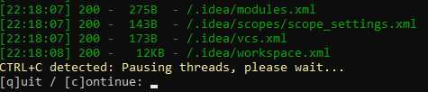

# Usage Guide

[](https://asciinema.org/a/380112)

These examples cover the most common arguments. Use `python3 dirsearch.py -h`
for common options or `python3 dirsearch.py -hh` for the complete option list.

## Simple Usage

```sh
python3 dirsearch.py -u https://target
```

```sh
python3 dirsearch.py -e php,html,js -u https://target
```

```sh
python3 dirsearch.py -e php,html,js -u https://target -w /path/to/wordlist
```

## Pausing Progress

dirsearch allows you to pause scanning with `CTRL+C`. From there, you can save progress and continue later, skip the current target, or skip the current sub-directory.



See [Sessions](sessions.md) for session save and resume behavior.

## Recursion

Recursive brute-force continues scanning inside discovered directories. For example, if dirsearch finds `admin/`, it will brute-force `admin/*`.

Enable recursion with `-r` or `--recursive`:

```sh
python3 dirsearch.py -e php,html,js -u https://target -r
```

Set maximum recursion depth and status codes:

```sh
python3 dirsearch.py -e php,html,js -u https://target -r --max-recursion-depth 3 --recursion-status 200-399
```

Additional recursion options:

- `--force-recursive`: recursively brute-force all found paths, not just paths ending with `/`.
- `--deep-recursive`: recursively brute-force all depths of a path, such as `a/b/c` -> `a/`, `a/b/`.

Exclude sub-directories from recursive scans:

```sh
python3 dirsearch.py -e php,html,js -u https://target -r --exclude-subdirs image/,media/,css/
```

When crawling is enabled, discovered paths inside these sub-directories are
excluded from the dynamic scan queue as well.

## Backup Discovery

Use `--find-backup` to queue backup candidates only after dirsearch matches a
file. For example, matching `test.php` adds candidates including `test.php~`,
`test.php.bak`, and `test.bak` without applying those suffixes to the entire
wordlist:

```sh
python3 dirsearch.py -u https://target --find-backup
```

Dynamic candidates honor `--exclude-extensions`. Media files and paths that
already look like backups are not expanded again. Full filenames receive
backup and archive suffixes, while extension-stripped basenames receive only
archive suffixes; for example, `test.php.swp` is valid but `test.swp` is not
generated.

## Threads

The thread count (`-t` or `--threads`) controls the number of separated brute-force processes. The default is 25.

Higher thread counts can make scans faster, but speed still depends on server response time. Avoid excessive thread counts because they can cause denial of service.

```sh
python3 dirsearch.py -e php,htm,js,bak,zip,tgz,txt -u https://target -t 20
```

## Asynchronous Mode

Asynchronous mode is the default runtime on Python 3.11 and newer. In this mode, dirsearch uses coroutines instead of threads for concurrent requests.

Asynchronous mode can offer better performance and lower CPU usage because it avoids switching between thread contexts. Pressing `CTRL+C` also pauses progress immediately without waiting for threads to suspend.

The synchronous Python stack and the native request backend remain available for compatibility and benchmarking. Use `--sync` to force the synchronous Python stack. Use `--request-backend native` to select the native backend; dirsearch will run that backend without async mode unless `--async` is explicitly supplied, which is rejected because the native backend has its own scheduler.

## Blacklists

The `db/` folder contains blacklist files. Paths in those files are filtered from scan results when they return the status code referenced in the filename.

For example, if you add `admin.php` to `db/403_blacklist.txt`, any `admin.php` result with status `403` will be filtered from output.

## Filters

Use `-i` / `--include-status` and `-x` / `--exclude-status` to include or exclude response status codes.

dirsearch also performs automatic wildcard and soft-404 calibration. You normally do not need to tune this, but `--auto-calibration` forces extra calibration samples from the beginning when a target is especially noisy.

```sh
python3 dirsearch.py -e php,html,js -u https://target --exclude-sizes 1B,243KB
```

Response size filters accept raw bytes without a suffix or readable units such as
`B`, `KB`, `MB`, and `GB`. The same format works for `--exclude-sizes`,
`--min-response-size`, and `--max-response-size`.

```sh
python3 dirsearch.py -e php,html,js -u https://target --exclude-text "403 Forbidden"
```

```sh
python3 dirsearch.py -e php,html,js -u https://target --exclude-regex "^Error$"
```

```sh
python3 dirsearch.py -e php,html,js -u https://target --exclude-redirect "https://(.*).okta.com/*"
```

```sh
python3 dirsearch.py -e php,html,js -u https://target --exclude-response /error.html
```

Advanced ffuf/wfuzz-style filters are available as opt-in controls, not as the main discovery model. For example:

```sh
python3 dirsearch.py -u https://target --match-status 200-299 --filter-regex "not found"
```

Response headers can also be used in advanced filters. Header text matching is
case-insensitive; header regex matching uses regular expressions:

```sh
python3 dirsearch.py -u https://target --filter-header "x-cache: fallback"
python3 dirsearch.py -u https://target --match-header-regex "etag: W/.+"
```

## Request Bodies

For a short request body, pass it directly:

```sh
python3 dirsearch.py -u https://target -m POST -d "username=admin&active=true"
```

For a saved or multiline body, use `--data-file`:

```sh
python3 dirsearch.py -u https://target -m POST --data-file body.txt
```

dirsearch sends the file exactly as saved. ASCII, UTF-8, Windows-encoded files,
CRLF, LF, mixed line endings, and a final newline require no dirsearch-specific
conversion option. If the server requires an explicit character set, declare it
in the content type:

```sh
python3 dirsearch.py -u https://target -m POST --data-file body.txt \
  -H "Content-Type: application/x-www-form-urlencoded; charset=windows-1252"
```

Use `--data-file` for a body only. Use `--raw request.txt` when the file contains
the complete HTTP request line, headers, and body.

## Raw Requests

dirsearch can import a raw request from a file:

```http
GET /admin HTTP/1.1
Host: admin.example.com
Cache-Control: max-age=0
Accept: */*
```

Since dirsearch cannot always infer the URI scheme from a raw request, set it with `--scheme` when needed. By default, dirsearch automatically detects the scheme.

## Scan Sub-Directories

Use `--subdirs` to scan a list of sub-directories from a URL:

```sh
python3 dirsearch.py -e php,html,js -u https://target --subdirs /,admin/,folder/
```

## Proxies

dirsearch supports SOCKS and HTTP proxies. You can provide one proxy or a file containing multiple proxies.
The threaded and native request engines support SOCKS4, SOCKS4a, SOCKS5, and
SOCKS5h. The async engine supports SOCKS5 and SOCKS5h.
The native engine supports username/password proxy authentication for HTTP(S)
and SOCKS5. SOCKS4 only defines a user ID; use the threaded engine when a
SOCKS4 proxy requires one.

```sh
python3 dirsearch.py -e php,html,js -u https://target --proxy 127.0.0.1:8080
```

```sh
python3 dirsearch.py -e php,html,js -u https://target --proxy socks5://10.10.0.1:8080
```

```sh
python3 dirsearch.py -e php,html,js -u https://target --proxies-file proxyservers.txt
```

## Reports

Supported report formats: `simple`, `plain`, `json`, `xml`, `md`, `csv`, `html`, `sqlite`, `mysql`, and `postgresql`.

JSON, XML, and HTML reports use a private recovery journal beside the output
while a scan is active, then publish one atomic snapshot at checkpoints and
completion. If a write or process interruption leaves that hidden journal in
place, reuse the same output path to recover its pending results.

```sh
python3 dirsearch.py -e php -l URLs.txt --output-formats plain --output-file report.txt
```

```sh
python3 dirsearch.py -e php -u https://target --output-formats html --output-file target.html
```

## More Examples

```sh
cat urls.txt | python3 dirsearch.py --stdin
```

```sh
python3 dirsearch.py -u https://target --max-time 360
```

```sh
python3 dirsearch.py -u https://target --auth admin:pass --auth-type basic
```

```sh
python3 dirsearch.py -u https://target --headers-file rate-limit-bypasses.txt
```

## Tips

- If the server has request limits, use proxy randomization with `--proxies-file`.
- To find backups only after matching a file, use `--find-backup`.
- To focus on folder-like candidates, combine directory-focused wordlists with suffixes such as `--suffixes /`.
- The mix of `--cidr`, `-F`, and `-q` can reduce noise and false negatives when brute-forcing a CIDR.
- To avoid a flood of `429` results while scanning a URL list, use `--skip-on-status 429`.
- If large server responses slow down the scan, consider the `HEAD` HTTP method instead of `GET`.
- If CIDR brute-forcing is slow, reduce request timeout and retries. Suggested values: `--timeout 3 --retries 1`.
